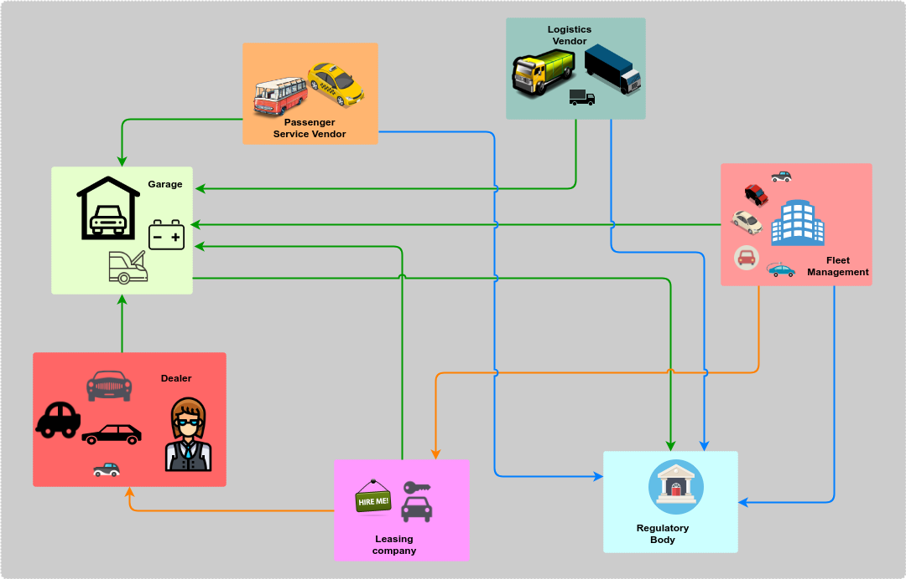
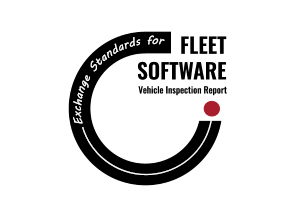

#  VIX - Vehicle Information eXchange

Vehicle Information eXchange is an open-source project established to define and set the standards and protocols
for systems to exchange information related to vehicle services, safety and dealership.
The need to exchange information is driven in part by compliance to government regulations, but also for
the day to day operations of fleet managers, workshops, hire & lease operators and dealers.

## The ecosystem
 

## The challenge
Businesses that operate in the industry often need and/or are required to
communicate with other parties within the same or across different groups. 
This communication is based on exchanging information in the form of documents. 
For example:

- HGV/PSV operator needs to obtain and store safety inspection data from workshops in order to 
comply with DVSA requirements.
- HGV/PSV operator is required to ensure that any hired or 
leased vehicle is in roadworthy condition and holds valid certificates to operate on the road.
- Vehicle dealer wants to access and share inspection reports with other parties.  

This exchange of information is very slow, repetitive and in most cases requires manual export/import of data.   

## Goals of the project
 - Establish a common rule for organizations to communicate with each other in robust and secure way.
 - Implement a simple and safe markup language for information exchange documents.
 - Provide tools for software providers to integrate and test their products against agreed standards.

## Benefits
This project will help organizations share information instantly and more securely. It will reduce
errors, improve access to information and allow businesses to focus on their core activities.
For software providers, it will increase marketability of their products and help them shape the industry.

For more information, please refer to [wiki pages](https://github.com/michal-nawrocki-techowls/vehicle-testing-report-exchange/wiki)

## Supported documents
- Safety inspection record for HGV/PSV (SIR)
- Vehicle defect record (VDR) 
## Implementation examples and tests
...

## Data protection
...

## Certificate
 \
When you see this logo it means product is compatible with "Fleet Software Exchange Standards" and software can exchange information between any other software where this logo appears. [To find out certificated software please visit this page ](./certificated-software/README.md)

## Certification Path
Our certification path is very easy. To be able to display our "Vehicle Documents Exchange Standard" logo in your product you need to meet our acceptance criteria requirements and pass all rest tests.
Acceptance criteria and tests are divided on two groups. First group is designed for  software responsible to share documents For Example Workshop/Garage the second group is designed for software will receive documentation for example Fleet Management. \
If you need any help please contact our team and we will help you with this process. <team@techowls.co.uk>

## Contributors
1. Michal Nawrocki
2. Adam Orendorz
3. Charles Moga 
